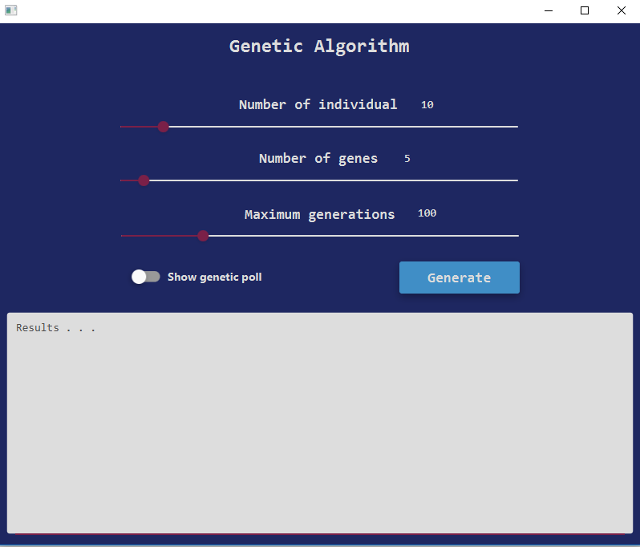

# GeneticAlgorithm
Refactoring and improving a [gist](https://gist.github.com/Vini2/bd22b36ddc69c5327097921f5118b709#file-simpledemoga-java) from Ms Vijini Mallawaarachchi ( [@Vini2](https://github.com/Vini2) )  
I also took the edit of [@liangyihuai](https://github.com/liangyihuai) into account.  
  
For this software I'll iteratively refactor the code with **some** of the best practices in the software industry. However, I kept the lab "sensation", hence, [Ms Vijini Mallawaarachchi](https://github.com/Vini2) could keep experimenting in the public static void main() method, as most data scientists do ;)  
  
I won't use fancy external lib such as for logging as I want Mrs Vijini Mallawaarachchi and her datascience readers to easily clone the repository and run it with no maven/gradle dependency to install.  
  
This is my gift to her for her very interrresting [article](https://towardsdatascience.com/introduction-to-genetic-algorithms-including-example-code-e396e98d8bf3).  
  
This repo focuses on :  
- Object Oriented Programming refactoring (if this work ins't done and she wants to continue improving her program, she'll find it harder to reuse the code if the structure is wobbly)  
- adding usefull and nice customizable printouts  
- going forward (I'try to add some more features I have in mind, relative to her genetic algorithm :) )  

## averroes96 contribution :

After reading [Ms Vijini Mallawaarachchi](https://github.com/Vini2)'s [article](https://towardsdatascience.com/introduction-to-genetic-algorithms-including-example-code-e396e98d8bf3), i came accross this optimized version to make it as the starting point to develop my study project which is about implementing a solution for SAT problem using genetic Algorithm with Java.

My contribution revolves around creating a simple GUI for Genetic Algorithms using :

- javaFX
- netbeans as IDE 
- SceneBuilder to design my interface
- [JFoenix](http://jfoenix.com/) library for material design 

This interface is based on MVC modeling and offers the ability to specify :

- Number of starting population
- Number of genes per individual
- Maximum number of generations
- Showing the genetic poll for each individual - or not -
- TextArea to print the generated results
  

